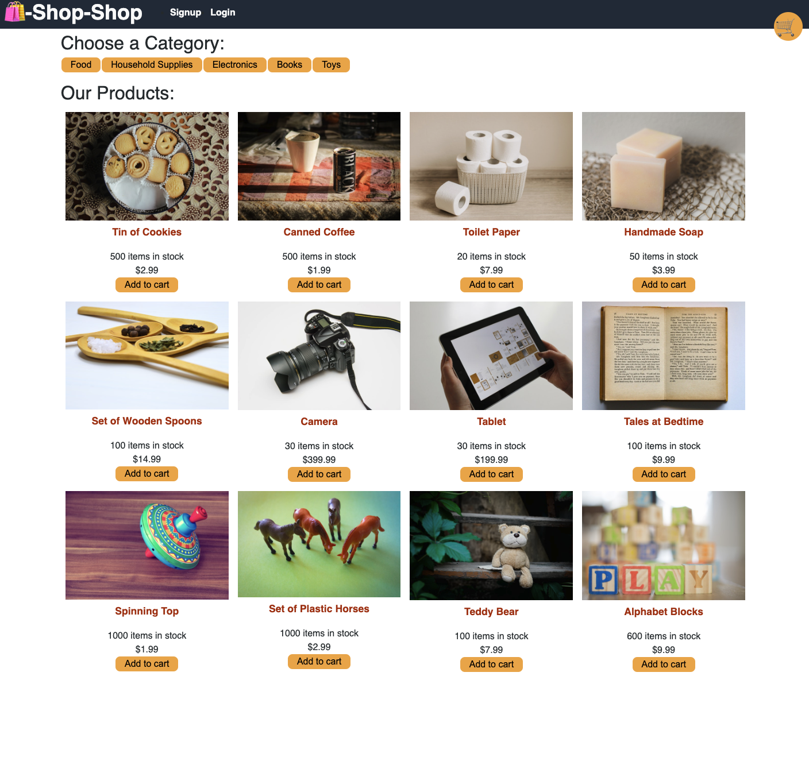

# Redux Store

<p> 
    
    
    
    
    
    
</p>


## Table of Contents
1. [Description](#description)
2. [User Story](#user-story)
3. [Screenshot](#screenshot)
4. [Heroku](#heroku)
5. [Installation](#installation)
6. [License](#license)
7. [Contributing](#contributing)
8. [Test](#test)
9. [Questions](#contact-information)

## Description
To build a e-commerce platform website use Redux library. 

## User Story
```md
AS a senior engineer working on an e-commerce platform
I WANT my platform to use Redux to manage global state instead of the Context API
SO THAT my website's state management is taken out of the React ecosystem
```

## Heroku
Please view the live application [here](https://app-redux-store.herokuapp.com/)

Before deploying to Heroku, you need to add mongoose to Config Vars 
* Key = `MONGODB_URI` where you could find in the `server/config/connection.js`
* Value = `mongodb+srv://dbUser:<password>@cluster0.hhmxmlu.mongodb.net/?retryWrites=true&w=majority` where you could find in the mongodb, and you will change the password to your mongodb password. 

Heroku requires a specific version of node and npm in order to install peer dependencies like GraphQL when deploying to Heroku. Be sure to refer to the [Heroku Docs on Specifying an NPM Version](https://devcenter.heroku.com/articles/nodejs-support#specifying-an-npm-version) to ensure your `package.json` file is set up correctly, as shown in the following snippet:

  ```json
  {
    "engines": {
        "node": "16.18.1",
        "npm": "7.x"
    }
  }
  ```

Once deployed, to seed the data in heroku, run `heroku run bash` then run `npm run seed`

## Screenshot



## Installation
To clone the repo:
```
git clone https://github.com/shelldan/redux-store.git
``` 
Run 'npm install' to install dependencies

Run 'npm run start' to start the backend

Run 'npm run develop' to start both backend and front end

---

## License
[](https://opensource.org/licenses/MIT) 

## Contributing 
To contribute to this application, create a pull request.
Here are the steps needed for doing that:
- Fork the repo
- Create a feature branch (git checkout -b NAME-HERE)
- Commit your new feature (git commit -m 'Add some feature')
- Push your branch (git push)
- Create a new Pull Request

Following a code review, your feature will be merged.

---

## Test:
There is no test available on this app yet. 

---

## Contact Information
* GitHub Username: [shelldan](https://github.com/shelldan)
